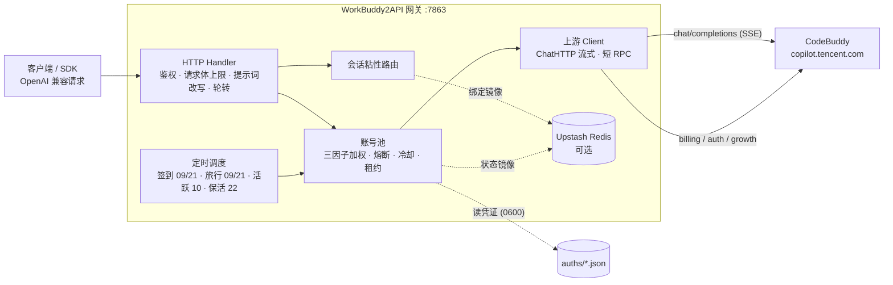

<p align="center">
  
</p>

<h1 align="center">WorkBuddy2API</h1>

<p align="center">
  <b>把 CodeBuddy 账号变成 OpenAI 兼容 API 的多账号网关</b><br>
  OAuth 登录 · 账号池轮转 · 熔断与冷却 · 会话粘性 · 积分补充
</p>

<p align="center">
  
  
  
  
  <a href="https://t.me/sliverkiss_blog"></a>
</p>

---

## 项目简介

WorkBuddy2API 是一个自托管的 **OpenAI 兼容反向代理网关**，将 ```CodeBuddy``` 账号包装为统一的 `/v1/chat/completions` 服务。

- 官方不提供 OpenAI 形态的开放 API，本项目通过 **OAuth 设备授权**（`login.sh`）获取账号凭证，在网关侧做 token 自动刷新、账号池调度与流量治理；
- 面向 **个人多账号** 场景：多账号共享、单号故障自动换号、冷却 / 熔断防止雪崩、会话粘性保证多轮上下文不跳号；
- 对客户端只暴露 OpenAI 兼容接口，现有 SDK / 前端 / 工具 **零改造接入**。

> ⚠️ 合规须知：本项目是**非官方**网关，使用 ```CodeBuddy``` 账号作为上游，**仅限本人授权账号、本机 / 私有环境测试**。详细边界见[安全与合规](#安全与合规)。

📖 完整文档见 [GitHub Wiki](https://github.com/Sliverkiss/workbuddy2api/wiki)。

## 核心能力

### 账号池治理

- **OAuth 设备授权登录** — `login.sh` 一条命令完成：取授权 URL → 浏览器登录 → token 轮询 → 凭证落盘 → 重启加载，全程无 PKCE（state 由服务端签发），重复执行即可连续添加多账号
- **四因子加权随机选号** — `credits 比例 ×10 + 闲置补偿 + 成功率 ×3 + 快过期积分占比 ×8` 四项加权（`pool.expiring_soon` 窗口内的积分优先消耗，默认 7 天），按权重降序取 **Top-5 候选短名单**，再在短名单内加权抽签（等权重候选先随机打乱防惊群、LRU 兜底覆盖全部候选），兼顾积分多、闲置久、成功率高、快过期积分先用掉的账号
- **防惊群** — 跳过 100ms 内刚被选中的账号，多账号同时待命时不打爆同一台
- **在途租约** — 单账号最大在途请求数（`pool.max_in_flight`）限制并发占用，占满的号不参与选号，避免单号过载
- **账本择优** — 每次成功请求按 `usage.credit` 折算每千 token 单价记入 `(账号, 模型)` 账本，免费 / 便宜的账号优先；观测按 EMA 平滑、6 小时未更新即失效，成本随上游活动实时变化

### 流量治理

- **分级熔断与冷却** — 429 软冷却（600s 起指数退避、封顶 `soft_rate_max`）、404 固定浅冷却、402 / 余额耗尽硬冷却至次日 04:00、连续失败熔断（`breaker_threshold` 触发后指数退避封顶 6h）
- **模型级限流独立冷却** — 6004（该模型使用量超限）只冷却触发调用的模型，切其他模型立即可用；`/status` 透出 `rate_limited_models` 台账
- **状态持久化** — 池状态（积分 / 冷却 / 熔断 / 计数）本地原子落盘 `state.json`，可选镜像至 Upstash Redis，重启后择优恢复

### 请求链路

- **流式 + 非流式** — 出站强制 `stream:true`；SSE 帧按 OpenAI 规范白名单重建；非流式由本地聚合为单响应
- **DeepSeek 思维链注入** — 出站请求体注入 `thinking.type=enabled` + 默认档位，`reasoning_content` 多轮回填，`reasoning_effort` 按模型档位自动降级
- **系统提示词体系** — 默认透传客户端原始 system（`passthrough` 模式，缺省），仅自定义配置 `custom` 时网关用自有提示词替换客户端 system/developer（从源头消除模板句误报）；`passthrough` 模式遇拦截自动降级中性提示词重试
- **会话头族注入** — 出站携带官方客户端会话头族（`X-Conversation-Request-ID` 聚合主键 · `X-Conversation-ID` 透传 · B3 链路），轮转 / 重试 / 路径回退复用同键，后台按对话轮聚合不再碎片化（issue #35）
- **指纹脱敏** — 出站请求体黑名单指纹字段清洗（可开关），与提示词体系两层叠加

### 定时积分任务

- **签到**（09 / 21 点）— 每日签到 + 余额查询，余额恢复自动解冻冷却账号
- **活跃上报**（10 点）— 对话事件连发上报，点亮连登天数、解锁领养前置，回读 streak 自检
- **猫猫旅行**（09 / 21 点）— 独立排程：领养 / 派出 / 领奖闭环推进
- **token 保活**（22 点）— 全账号刷新 token，session 失效连续 3 次才禁用
- **开学季任务**（12 点）— 任务点亮 + claim + 自动抽空抽奖余额，活动下线时自动跳过
- **夜猫子任务**（01 点）— 夜猫窗口（23:00–08:00 CST）内补一次 black_cat 任务

六类任务独立排程、独立开关（`schedule.*_enabled`），互不影响。

### 双域适配

- 同时适配**国内版（CN，`copilot.tencent.com` / `www.codebuddy.cn`）与国际版（Global，`www.workbuddy.ai`）**账号
- 共享同一账号池，由账号 `realm` 或请求模型名前缀（`cn:` / `global:`）决定路由；`global.enabled` 可一键锁死纯 CN 部署
- 国际版支持注册激活、地区完善、一次性 trial 加油包领取（`./trial.sh`）

### 辅助工具

- 积分日报：`./credit.sh`（美化 / `-json`，realm 感知双域）
- 手动签到：`./signin.sh`（批量、幂等不重复计）
- 领养联动 / 任务查询：`scripts/task_runner.py`（成长任务一体机，默认 dry-run）
- 个性化提示词：`prompt.file` 指向自定义提示词文件即整体替换内置默认

## 架构总览



上游请求在出站前经历统一的改写管线（`internal/upstream/payload.go`）：强制 `stream:true`、`developer` 角色归一、tool_choice 归一、DeepSeek 思维链注入、`reasoning_effort` 档位降级、`reasoning_content` 回填、指纹脱敏。

## 快速开始

### 环境要求

- **Docker + Docker Compose**（推荐部署方式，镜像内已含 `app` 低权限用户与全部工具脚本）
- 一个或多个已注册的 CodeBuddy 账号，用于 OAuth 登录
- 宿主机 Go ≥ 1.22（仅源码构建时需要）

### Docker Compose 一键部署与 Web 控制台

服务器安装 Docker Compose，取得本版本完整源码后，在项目目录执行：

```bash
docker compose up -d
```

首次会从锁定的 `upstream/` 快照、`extensions/` 和有序补丁构建 `core`，并单独构建 `console`。只有 console 映射宿主机端口；两个服务都以 UID 10001 运行。更新源码后使用 `docker compose up -d --build` 重新构建。

打开 `http://服务器地址:7863/`，即可看到中文控制台：

1. 首次查看 `docker compose logs console`，将日志中的「管理密钥」输入网页。管理密钥保存在独立凭据卷中，重启保持不变。
2. 在「账号管理」选择国内版或国际版，点击「浏览器授权」，在上游页面完成登录、扫码或验证码。控制台自动等待、保存并加载账号，无需重启。
3. 国际版需要完善地区时，在网页选择实际注册地区并继续；激活失败会提示重试。
4. 在「运行概览」查看账号状态，在「对话测试」选择模型发送问题，可查看流式回答、推理内容、用量或停止生成。
5. 在「API 接入」取得 Base URL 与 API Key，连接其他客户端。API Key 与管理密钥互相独立。

“一条命令”指启动服务；首次取管理密钥和上游人工登录仍需你操作。网关不会代输上游密码或完成验证码。网页对话仅保留在当前页面内存中，刷新会清空；工具调用仅展示，不执行。

**持久化与配置**

默认使用三个命名卷：`workbuddy2api_auths` 保存上游账号凭据，`workbuddy2api_data` 保存账号状态，`workbuddy2api_keys` 保存三种互不相同的部署密钥。core 是唯一初始化者，console 只读挂载凭据卷且不挂载账号或状态卷。普通重启或重建保留数据；不要使用 `docker compose down -v`。

可选在 `.env` 中预设（不设置也能启动）：

```dotenv
# 至少 32 个字符，使用随机生成的强密钥；不要与其他密钥相同
WB2A_ADMIN_KEY=
WB2A_API_KEY=
WB2A_PORT=7863
# HTTPS 反向代理时设置为浏览器实际访问的 origin，无路径
WB2A_PUBLIC_ORIGIN=
```

管理和 API 环境覆盖由两个服务共同校验并在运行时生效，不改写凭据卷；去掉覆盖会回到原持久值。API Key 可以沿用旧的非空值。Docker 双服务不接受只写在 core `config.json` 中、且与持久基础值不同的 `api_key`；请改用两个服务共享的 `WB2A_API_KEY`，避免 console/core 分叉。公网使用 HTTPS 反向代理，并将 `WB2A_PUBLIC_ORIGIN` 设置为例如 `https://gateway.example.com`；转发到 console 的 7863 端口，保留 Host，关闭聊天接口的响应缓冲。

需要修改定时任务等配置时，将自定义配置以只读方式挂载到 core 的 `/app/config.json`。默认六类定时任务开启，会按排程实际调用上游；可通过 `schedule.*_enabled` 关闭。API Key 请通过共享 `WB2A_API_KEY` 设置，不要在生产配置中保留示例 `test_key`。

**旧部署与 CLI 兼容**

先检查旧容器实际挂载，不从 Compose 项目名猜卷名；命令只输出脱敏后的容器身份和 `/app/auths`、`/app/data` 映射，不读取容器环境变量：

```bash
python3 deploy/migrate.py inspect --container OLD_CONTAINER > /tmp/wb2a-migration.json
python3 deploy/migrate.py backup --manifest /tmp/wb2a-migration.json --output /ABSOLUTE/NEW/BACKUP/DIR
```

运行中备份会明确标记为非最终一致性备份；正式切换前应停止旧实例后再做最终备份。确认卷名后，在 `.env` 显式复用：

```dotenv
WB2A_AUTHS_VOLUME=旧账号卷名
WB2A_DATA_VOLUME=旧状态卷名
```

旧数据中的 `console-keys.json` 保持原字节不变，首次启动会迁移原管理/API Key 并新增桥接密钥；旧文件损坏或与现有凭据卷冲突时启动失败，不会自动覆盖或轮换。绑定目录也受迁移工具支持，但生产 Compose 默认使用明确命名卷。

**健康检查**

- `/livez`：进程存活，Docker HEALTHCHECK 使用此端点。空账号池也返回 200，方便首次登录。
- `/healthz`：账号当前能否服务；无可用账号返回 503，不代表控制台没有启动。

**镜像交付**

当前 Compose 构建本仓库锁定快照，不拉取“最新上游”。core 的诊断信息内嵌锁定 commit 与扩展/补丁身份摘要。只有明确发布了这两个镜像后，才能把 `build` 换成对应 `image`；本仓库不会在普通启动时推送或发布镜像。

**手动更新上游与回退**

更新必须显式给出上游 ref；工具只从 `upstream.lock` 中批准的 canonical 仓库拉取，在临时候选目录完成完整检查、镜像构建和隔离 mock 验收。失败时当前 `upstream/`、锁文件、容器和数据卷都不变，并打印保留的候选目录。成功也只改工作区中的 `upstream/` 和 `upstream.lock`，不会提交、推送或部署：

```bash
python3 scripts/overlay.py update --ref COMMIT_OR_TAG
git diff -- upstream upstream.lock
git add upstream upstream.lock
git commit -m "build: update pinned upstream"
docker compose up -d --build
```

若验收后需要回到旧组合，先对记录该组合的提交执行可审阅的反向提交，再明确重建；若同一版本还改过扩展或补丁，应一起回退对应提交：

```bash
git revert --no-commit UPSTREAM_UPDATE_COMMIT
git diff
git commit -m "revert: restore previous upstream combination"
docker compose up -d --build
```

更新和回退都不要使用 `docker compose down -v`；账号、状态、任务记录和密钥卷应原样保留。相关源码路径有未提交改动时，更新入口会拒绝覆盖，请先提交或另行保存这些改动。

### 源码构建

```bash
python3 scripts/overlay.py prepare --output .build/core
bash scripts/check.sh /ABSOLUTE/PATH/TO/workbuddy2api
bash scripts/acceptance.sh /ABSOLUTE/PATH/TO/workbuddy2api
```

构建二进制：

```bash
CGO_ENABLED=0 go build -trimpath -ldflags="-s -w" -o wb2api ./cmd/server
CGO_ENABLED=0 go build -trimpath -ldflags="-s -w" -o signin_bin ./cmd/signin
CGO_ENABLED=0 go build -trimpath -ldflags="-s -w" -o login ./cmd/login
CGO_ENABLED=0 go build -trimpath -ldflags="-s -w" -o credit ./cmd/credit
```

### 验证

```bash
# 模型列表
curl -s http://localhost:7863/v1/models -H "Authorization: Bearer your-api-key"

# 账号状态（汇总 + 每账号详情，disabled 账号透出 disabled_reason）
curl -s http://localhost:7863/status -H "Authorization: Bearer your-api-key"

# 流式聊天
curl -sN http://localhost:7863/v1/chat/completions \
  -H "Authorization: Bearer your-api-key" \
  -H "Content-Type: application/json" \
  -d '{"model":"deepseek-v4-flash","messages":[{"role":"user","content":"hi"}],"stream":true}'

# 非流式聊天（本地聚合）
curl -s http://localhost:7863/v1/chat/completions \
  -H "Authorization: Bearer your-api-key" \
  -H "Content-Type: application/json" \
  -d '{"model":"deepseek-v4-flash","messages":[{"role":"user","content":"hi"}],"stream":false}'
```

## 安全与合规

### 发布来源与合规边界

- **构建来源**：默认 Compose 从本地源码构建；多架构镜像发布流程见 `.github/workflows/build.yml`，以实际发布的版本为准。
- 登录 / 签到 / 积分工具：`./login.sh` / `./signin.sh` / `./credit.sh`
- **依赖校验**：`go.sum` 约束 Go 模块依赖；Dockerfile 基于官方 Go/Alpine 镜像构建。
- 上游 CodeBuddy 属第三方商业产品，本项目是其**非官方 OpenAI 兼容网关**；使用其账号做 API 网关涉及目标平台服务条款与账号风险，作者不对账号封禁、条款违约或使用结果负责

### 授权使用边界

- 仅限**本人授权账号**、本机 / 私有环境测试
- 不得共享、转售、违规分发，或用于违反目标平台条款的用途
- 遵守 CodeBuddy 平台服务条款与所在地法律
- 妥善保管 `auths/`（明文凭证）与网关端口

## 免责声明

本项目（包括但不限于代码、脚本、文档、配置示例及仓库内任何资源，下称「本项目内容」）**仅供个人学习与研究使用**。使用本项目表示您已阅读并接受本声明全部条款；如不同意，请立即停止使用并删除全部相关内容。

**1. 用途限制。** 本项目内容仅可用于个人学习、研究等非商业用途；请勿将本项目用于任何商业目的或牟利行为，请勿违反所属国家 / 地区 / 组织的任何法律法规。本项目不构成对任何软件、服务、平台的使用建议或授权。

**2. 账号与数据责任。** 本项目可能涉及个人账号凭证的获取、存储与使用。您应仅使用本人持有且已获授权的账号，自行确认相关平台的服务条款与允许范围，并自行承担使用、存储凭证（如 `auths/` 中的文件）及调用上游服务所产生的全部责任与风险。本项目不参与、不介入您与任何平台之间的契约关系。

**3. 内容与第三方界限。** 本项目内容中引用的第三方产品、服务、LOGO、图片、文案等，其权利均归各自权利人所有；本项目不保证此类内容的准确性、完整性、合法性，亦不代表支持或推荐任何第三方。如实存在侵权情形，请通过 Issues 告知，经核实后本项目会尽快处理。

**4. 无担保与风险自担。** 本项目内容按「现状」提供，不附带任何明示或默示的担保（包括但不限于适销性、特定用途适用性、准确性、不侵权等）。使用本项目（包括直接或间接）所产生的任何风险与后果（包括但不限于账号异常、数据丢失、服务中断、纠纷或损失），均由使用者自行承担，与本项目及其全部贡献者无关。

**5. 责任限定。** 在任何情况下，本项目及其作者、贡献者均不对任何直接、间接、偶然、特殊或后果性损害承担责任，无论该等损害是否基于合同、侵权或其他法律理论，即使已被告知发生该等损害的可能性。

**6. 修改与分发。** 基于本项目源代码进行的任何修改、衍生均系第三方自发行为，与本项目无关，相应后果由该第三方自行承担。本项目内所有资源文件，禁止任何公众号、自媒体进行任何形式的转载、发布。未经授权，任何组织或个人不得将本项目内容用于转载、发布或再分发。

**7. 条款变更。** 本项目保留随时修改、补充本声明的权利。修改后的声明自发布之日起生效，继续使用本项目即视为接受修订后的声明。本项目所有内容仅供学习和研究使用，请于学习研究完成后及时删除。

## ☕ Coffee

如果这个项目对你有帮助，欢迎请我喝杯咖啡～

<table>
  <tr>
    <td align="center"><b>💰 Solana</b></td>
    <td><code>AZAKF74rTu7UFVSNRzsKV4HHpTwarax6cG8KAh4fP5rQ</code></td>
  </tr>
  <tr>
    <td align="center"><b>💎 Ethereum</b></td>
    <td><code>0x1d418627aD6B043900CBE11fe439759bDF2b5170</code></td>
  </tr>
  <tr>
    <td align="center"><b>₿ Bitcoin</b></td>
    <td><code>bc1q9w7h4j9msyd9q6lhl0398n4s3g8h4vchpqvc2k</code></td>
  </tr>
</table>

## License

本项目采用 [MIT License](LICENSE) 开源协议。

- 在遵守 MIT License 前提下，允许使用、复制、修改、合并本项目源代码
- 再分发（源码或二进制形式）时，须保留原仓库的 MIT 版权声明与许可声明，并在 NOTICE 或 README 中注明原始出处 `https://github.com/Sliverkiss/workbuddy2api`
- 本项目不授予任何上游（CodeBuddy）接口或服务的权利；使用者仍需自行遵守上游服务条款
- 本项目的使用同时受上方**免责声明**约束；如免责声明与 MIT License 存在不一致，以免责声明为准
