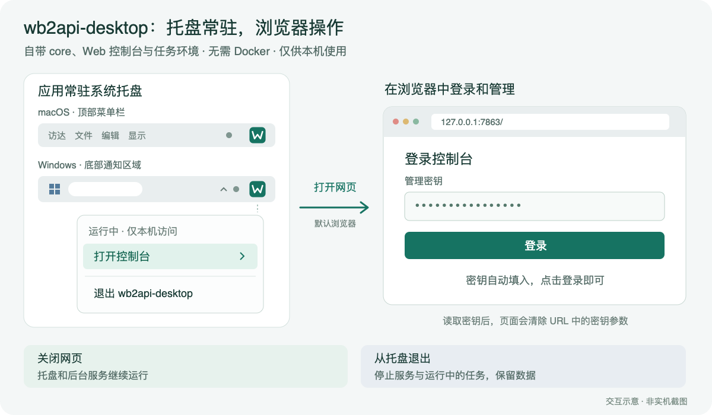
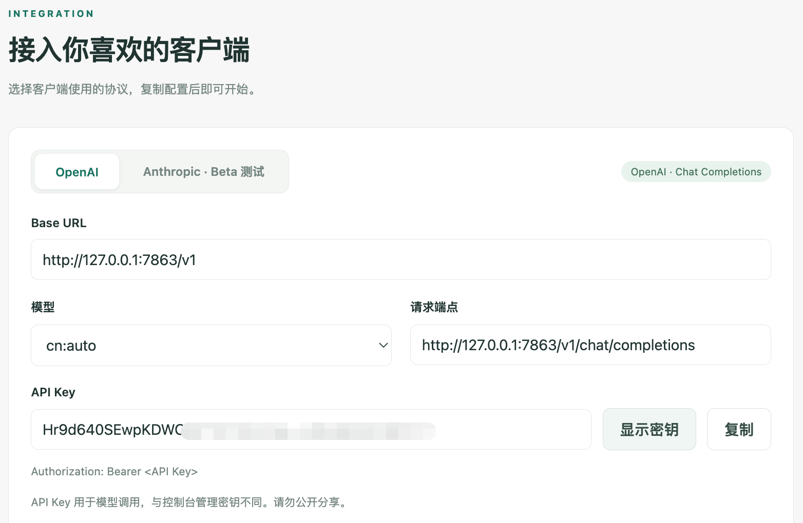
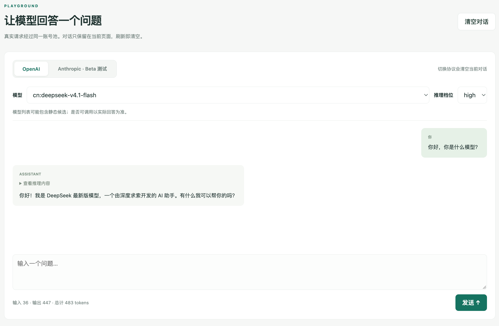
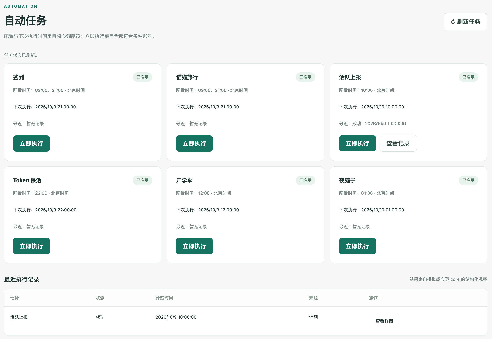

<div align="center">

# WB2api

### 让 WorkBuddy 用到更多地方

**将 WorkBuddy 反向代理为通用的 OpenAI / Anthropic 协议兼容 API，自动获取积分，多账号轮换**

**可供 Deepseek Harness Desktop、Claude Code、Claude Desktop、Codex、Gemini CLI、Grok Build、OpenCode、OpenClaw、Hermes Agent、Pi、MiniMax Code、ZCode 工具使用**

**[下载安装](#下载安装) · [快速开始](#快速开始) · [功能特性](#功能特性)**

</div>

## 为什么选择 wb2api？

已经有了 WorkBuddy 账号，想把模型用到自己习惯的 AI 应用里？每天还要记得签到、查看活动、检查账号状态？

**wb2api 把这些事放到一个地方：授权账号、接入应用，剩下的日常任务让后台按计划执行。**

- **让账号能力多一个出口。** 提供 OpenAI 兼容接口与 Anthropic 文本接口，为支持自定义服务地址的应用提供接入方式。
- **少一点重复操作。** 签到、猫猫旅行、活跃上报等任务集中运行，不用每天挨个手动点；结果和积分记录在网页里查看。
- **桌面使用更省心。** `wb2api-desktop` 自带运行环境，启动后打开浏览器即可操作，无需另装 Docker、Python 或 Node.js。
- **多个账号，一个入口。** 统一查看账号状态、管理授权、连接应用，账号和运行记录保存在自己的电脑或服务器上。

平时在自己电脑上用，选桌面端；希望服务持续在线，选 Docker 服务端。两种方式共用同一套功能。

## 界面预览

<table>
  <tr>
    <td width="50%" align="center" valign="bottom">
      <a href="docs/superpowers/verification/wb2api-desktop-tray-diagram.png">
        
      </a>
      <br>
      <strong>桌面托盘</strong>
    </td>
    <td width="50%" align="center" valign="bottom">
      <a href="docs/superpowers/verification/2026-10-09-api-access.png">
        
      </a>
      <br>
      <strong>通用API输出</strong>
    </td>
  </tr>
  <tr>
    <td width="50%" align="center" valign="bottom">
      <a href="docs/superpowers/verification/2026-10-09-chat-playground.png">
        
      </a>
      <br>
      <strong>在线对话</strong>
    </td>
    <td width="50%" align="center" valign="bottom">
      <a href="docs/superpowers/verification/2026-10-09-auto-tasks.png">
        
      </a>
      <br>
      <strong>获取积分（自动签到、完成任务）</strong>
    </td>
  </tr>
</table>

*点击图片可查看大图。托盘图为交互示意，其余为当前界面截图。*

## 下载安装

### 在自己的电脑上使用

<a href="https://github.com/baiyea/workbuddy2api-ui/releases">下载地址</a>
安装后常驻系统托盘，网页和API接口只在本机开放。

| 你的电脑 | 对应安装包 |
| --- | --- |
| Apple Silicon Mac，macOS 12 或更新版本 | `wb2api-desktop-macos-arm64-<版本号>.dmg` |
| Intel Mac，macOS 12 或更新版本 | `wb2api-desktop-macos-x64-<版本号>.dmg` |
| Windows x64 | `wb2api-desktop-windows-x64-<版本号>.exe` |

目前桌面端处于**开发预览阶段**：macOS 已完成开发打包，尚未正式签名公证；Windows 安装包与真机验证仍在准备。当前没有正式发布的安装包下载入口。

→ [查看桌面端获取、构建及使用说明](desktop/README.md)

### 在自己的服务器上使用

已有安装 Docker 和 Docker Compose 的 Linux x64 服务器，可以保存 [docker-compose.yml](docker-compose.yml) 后运行：

```bash
docker compose up -d
docker compose logs console
```

打开 `http://服务器地址:7863/`，用docker日志里的管理密钥登录。

## 快速开始

### 基本使用

**第一步：打开控制台。**

启动桌面端后，默认浏览器会自动打开，管理密钥也会自动填好。点击登录即可进入；Docker 用户通过服务器地址登录。

**第二步：添加自己的账号。**

进入“账号管理”，选择国内版 CodeBuddy 或国际版 WorkBuddy，点击“浏览器授权”。在上游页面完成登录、扫码或验证码，授权成功后账号会自动加载。

**第三步：试一个回答，再接入应用。**

先到“对话测试”选择模型、发一条消息，确认账号可以使用。再到“API 接入”，将页面提供的地址、API Key 和模型名称填入目标应用。

| 需要填写的内容 | 从哪里获取 |
| --- | --- |
| 服务地址（Base URL） | 控制台“API 接入”；桌面端的 OpenAI 地址为 `http://127.0.0.1:7863/v1` |
| API Key | 同一页面查看，与网页登录用的管理密钥不同 |
| 模型名称 | 使用控制台显示的完整模型名称 |

**我常用的 AI 工具能接入吗？**

先看它是否支持自定义服务地址，以及所需功能是否与本项目已实现的接口匹配。Claude Code、Codex、OpenCode 等编程助手还有工具调用等要求，不能仅凭协议名称判断完整兼容。当前主要提供模型列表、聊天与流式回答，以及 Anthropic 文本对话；更多工具的接入效果欢迎反馈实测结果。

### 自动获取积分

**让签到等日常任务按时执行，少一些每天手动操作的麻烦。**

1. 完成账号授权后，打开“自动任务”，查看已有任务的启用状态和执行时间。
2. 保持应用或服务运行，已启用任务会按计划执行；需要立即尝试时，点击对应任务的“立即执行”。
3. 在执行历史中查看结果、失败原因和上游明确返回的奖励，方便了解哪些任务已经完成。

支持签到、猫猫旅行、活跃上报、Token 保活、开学季、夜猫子六类任务。其中有日常维护任务，也有受活动时间与账号条件限制的任务；**自动执行不等于保证获得积分，实际奖励以上游返回为准。** 页面可查看排程并手动运行，暂不提供修改排程和开关的功能。

桌面端关闭网页后仍会运行；从托盘退出应用、电脑休眠或关机后，任务无法继续按时执行。希望持续运行，可以选择 Docker 服务端。

## 功能特性

| 功能 | 你可以用它做什么 |
| --- | --- |
| 统一 API 入口 | 将账号的模型能力接入符合接口要求的应用和脚本 |
| 多账号管理 | 在一个页面里完成授权，查看各账号的可用状态 |
| 网页对话测试 | 接入其他应用前，先确认模型是否可用、回答是否正常 |
| 六类自动任务 | 按已有排程运行任务，减少重复操作 |
| 执行记录与积分观察 | 查看任务结果，区分已确认奖励和待确认状态 |
| 桌面端与 Docker 服务端 | 根据本机使用或服务器运行的需要选择安装方式 |

wb2api 是非官方开源项目，请使用本人授权的账号并遵守上游平台规则。模型、额度与活动是否可用，取决于账号和上游服务；请妥善保管密钥，不要公开分享账号数据或带密钥的日志。

## 贡献、开发与来源

觉得好用，欢迎给项目一个 Star，也欢迎分享你的使用体验。

发现问题或想支持新的使用场景，可以提交 Issue；欢迎贡献代码、完善文档，或分享已验证的客户端配置。反馈时请附上系统版本、操作步骤和脱敏后的错误信息，方便定位问题。

本项目基于 [Sliverkiss/workbuddy2api](https://github.com/Sliverkiss/workbuddy2api)，在保留原作者版权与许可的基础上，增加 Web 控制台、原生桌面端、任务记录等能力。

想参与开发，可查看 [开发指南](AGENTS.md)；桌面端相关说明见 [desktop/](desktop/README.md)。

## License

遵循 [MIT License](LICENSE)。欢迎使用、修改与再分发，请保留原作者版权声明和许可。
