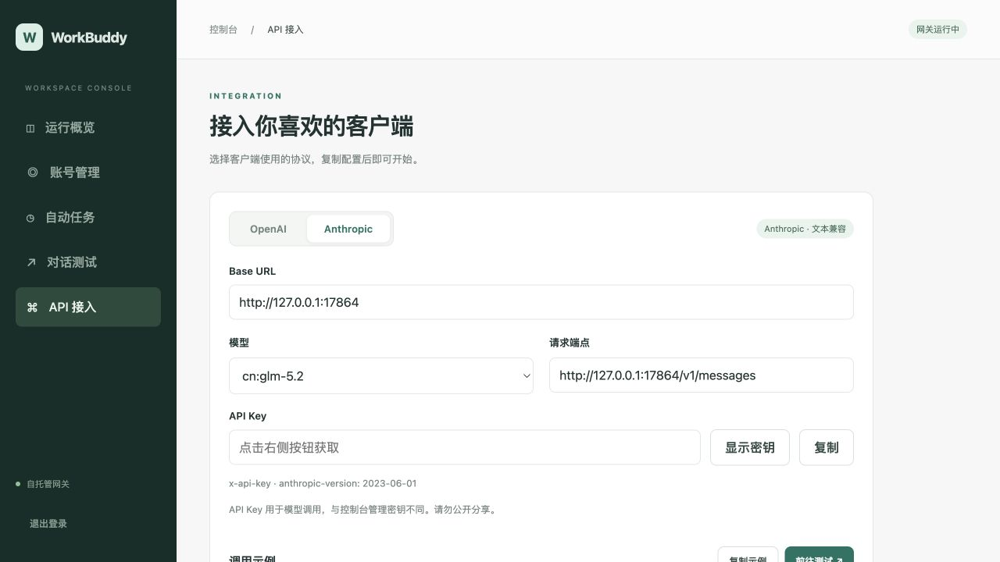
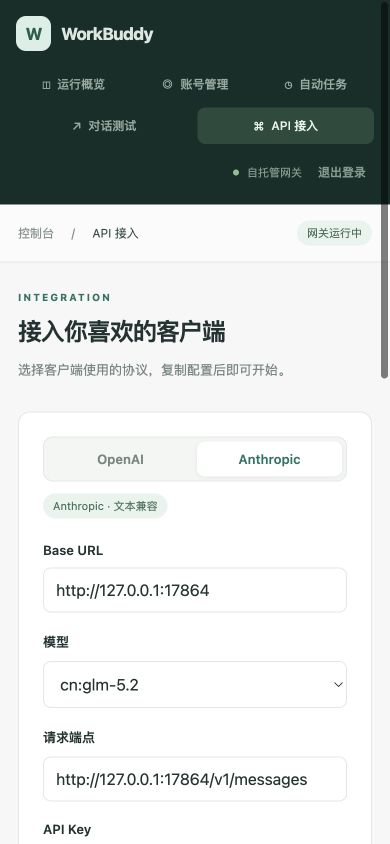
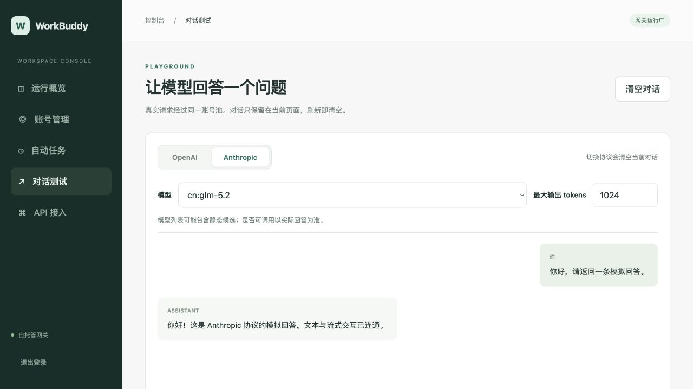

# Anthropic 文本接口验证记录

日期：2026-09-16。实现基线 `e1cec93`，分支 `codex/anthropic-text-api`。以下是实际执行结果，不是设计承诺。

## 自动化结果

命令均从仓库根目录运行，全部退出码为 0：

| 命令 | 实际结果 |
| --- | --- |
| `python3 -m unittest discover -s scripts -p 'test_*.py' -v` | 43 项通过。 |
| `python3 -m unittest discover -s deploy -p 'test_*.py' -v` | 13 项通过。 |
| `bash scripts/check.sh` | 新目录物化；全部 core Go 测试和 vet、7 个关键包 race（含 anthropic）、console race 通过；Node 29 项、Python 任务 15 项通过。 |
| `bash scripts/acceptance.sh`（见下方环境参数） | 本地 amd64 镜像构建、fresh/rebuild/legacy 隔离容器验收及真实网关 SDK 验收通过。 |
| `docker compose --env-file /dev/null -f docker-compose.yml config --quiet` | 通过。 |
| `bash -n scripts/acceptance.sh`、`git diff --check` | 通过。 |

SDK 解释器来自已有临时虚拟环境，没有新增生产依赖。实际容器验收命令：

```bash
WB2A_SDK_PYTHON=/var/folders/2d/7_7sxh6x765czbqjt7s_qkyw0000gn/T/wb2a-sdk.vmx3yq/venv312/bin/python \
WB2A_BUILD_HTTP_PROXY=http://host.docker.internal:7890 \
WB2A_BUILD_HTTPS_PROXY=http://host.docker.internal:7890 \
bash scripts/acceptance.sh
```

构建代理按测试授权显式传入，仅用于构建，没有更改宿主 HTTP_PROXY 或 Compose。此临时解释器路径不是部署要求。

SDK 实际输出：

```text
python=3.12.13 anthropic=0.67.0 httpx=0.28.1
local gateway
  ordinary JSON: PASS
  raw SSE: PASS
  aggregate: input=1, output=1
  aggregate: PASS
PASS: isolated gateway
acceptance passed: fresh/rebuild/legacy; isolated mock URL http://127.0.0.1:52631/
```

SDK 通过 `--url` 真正访问该隔离网关，不是仅消费手写响应。普通文本、raw event 顺序、`text_stream` 和最终消息聚合均通过。另以同一解释器运行 `scripts/check_anthropic_sdk.py` 的内存契约测试：unknown→known 最终 3/2、unknown→unknown 最终 None/None；两组普通响应、raw SSE、最终聚合均通过。后者验证 null/晚到用量契约，不替代容器集成结果。

## 覆盖与边界

- 保留所有旧 OpenAI 验收：模型列表、`mock-runtime-ok` 流式回答和 `[DONE]` 等原断言未删减。
- 新增 Anthropic JSON 文本、`end_turn`、真实 mock 上游 1/1 token；SSE 正常 `message_stop` 且无 `[DONE]`；401/400 同时检查 HTTP 状态与 Anthropic 错误包类型。
- 新增 `/admin/messages`：无会话 401、缺 CSRF 403、异源 403、有效 envelope 得到文本响应。管理会话、取消、私有头隔离的更细回归由完整 Go/Node 测试覆盖。
- 原隔离验收同时验证密钥覆盖/恢复、只读密钥挂载、无生产健康检查、非 root、时区、配置缺失/目录/非法 JSON 拒绝、legacy 任务开关与排程、持久历史和数据保留。只读启动失败等负向用例日志是预期结果，不是验收失败。
- 隔离项目 `wb2api-task4-1789548941-74496` 及其 `-legacy` 的容器、临时存储由脚本清理；随后按项目标签核查无残留容器和测试卷。本地测试镜像/构建缓存保留，未发布。
- `upstream/`、`upstream.lock`、`patches/`、生产/源码 Compose 和 deploy 文件未修改；真实服务、账号、runtime、既有容器/卷未操作。没有 Git 推送、镜像发布或实际服务部署。
- 真实上游模型调用、积分和 Claude Code 客户端未验收。这里只承诺设计中的文本子集；工具/图像/思考等高级能力不支持，未知用量 `null` 不等于原生 API 的整数用量，不能推及所有客户端。

## 浏览器验收与截图

主控在本地 17864 的实际嵌入式 mock 页面完成检查，最终 fixture 编译启动晚于最终 `app.js` 修改；UI 规格及质量独立审阅均通过，无 findings。以下浏览器证据由主控采集、逐张目视检查并授权纳入：

- 默认 OpenAI；Anthropic 根 Base URL、完整端点、固定 version 和 x-api-key 示例正确。真实 mock 模型前缀保留，协议/模型可带入对话测试。
- 首段在完成前可见；生成时相关协议、模型、清空和 max_tokens 控件禁用，跨页导航不中断。停止恢复控件，fixture 日志确认浏览器断开传到 core。
- Anthropic 完整 mock 回答显示“上游未返回用量”；切换 OpenAI 清空对话并恢复推理控件，旧 OpenAI 回答及 5/20/25 用量正常。
- 桌面 1280 与窄屏 390 的接入/对话页面均无横向溢出；窄屏字段纵向排列。密钥揭示与退出清理正常，curl 仍保留占位符。
- 临时视口、主控预览标签与 fixture 进程均已清理，未影响真实服务或用户标签。







截图仅来自 mock 页面，不展示真实密钥，不证明真实模型可用；使用正常视口截图，没有修改 DOM 或加工图片伪造状态。

## SDD 执行偏差

唯一 ruling：fresh spawn 遇到线程上限，主控改为复用已完成代理，并通过独立任务 brief 与 reviewer 隔离上下文；代价是仍存在旧 context 污染风险。未因此省略任务规格/质量独立审阅、浏览器验收或全量验证。
